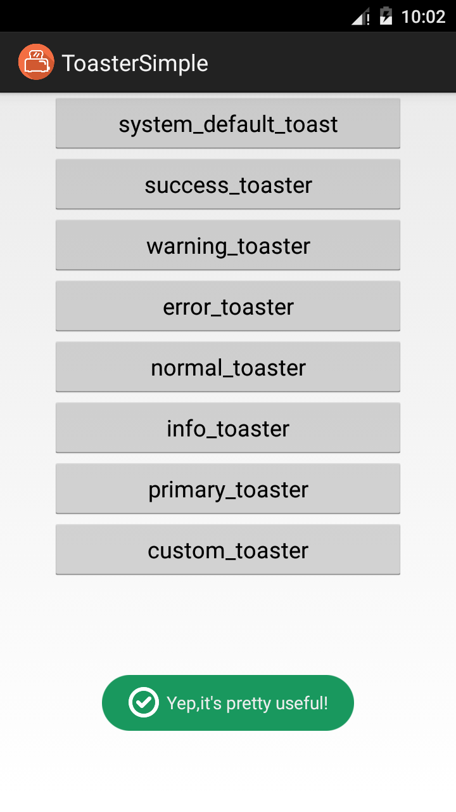
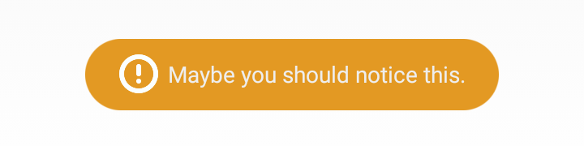
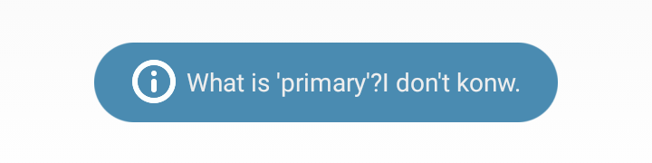

# Toaster

[](https://www.android.com)
[](https://android-arsenal.com/api?level=9)
[](http://www.opensource.org/licenses/mit-license.php)
[](https://jitpack.io/#Wang-Jiang/Toaster)

<div align="center">
	
</div>

## 什么是Toaster

正如名字所言，这是一个烤面包机，它可以产生一些自定义的Toast，你可以通过使用它用来替换系统默认的Toast

## Dependency

Add it in your root build.gradle at the end of repositories:

	allprojects {
		repositories {
			...
			maven { url 'https://jitpack.io' }
		}
	}

Add the dependency

	dependencies {
		compile 'com.github.Wang-Jiang:Toaster:v0.1'
	}

## 如何使用

Toaster的使用方式很简单，它提供了一些默认的样式方便在不同的场景下使用

它内置了`success()`，`error()`，`warning()`，`info()`，`primary()`等方法

显示一条表示成功的Toast

```java
Toaster.success(context, "Yep,it's pretty useful!", Toaster.LENGTH_SHORT).show();
```

运行的效果

<div align="center">
	
</div>

其他方法类似，下面是效果截图

<div align="center">
	<br>
	<br>
	<br>
	<br>
	<br>
</div>

你还可以替换掉默认的图片

```java
 Toaster.success(context, getResources().getDrawable(R.drawable.ic_coffee_cup), "替换了默认的图片", Toaster.LENGTH_SHORT).show();
```

## 注意事项

Toaster的所有方法都返回一个Toast对象，所以**不要忘记调用`show()`去显示Toast**

同时，因为直接返回一个Toast对象，你完全可以在返回的对象基础上自定义，比如设置显示位置等等

## 感谢

这个项目参考了[GrenderG](https://github.com/GrenderG) 的 [Toasty](https://github.com/GrenderG/Toasty)，实际上你可以发现这两个项目很大程度上很相似，因为都只是简单地自定义Toast，并不像有的项目通过继承View完全自己实现了一个Toast

## 开源协议

开源协议，我认可MIT

        The MIT License (MIT)

        Copyright (c) 2017 Wang-Jiang

        Permission is hereby granted, free of charge, to any person obtaining a copy
        of this software and associated documentation files (the "Software"), to deal
        in the Software without restriction, including without limitation the rights
        to use, copy, modify, merge, publish, distribute, sublicense, and/or sell
        copies of the Software, and to permit persons to whom the Software is
        furnished to do so, subject to the following conditions:

        The above copyright notice and this permission notice shall be included in all
        copies or substantial portions of the Software.

        THE SOFTWARE IS PROVIDED "AS IS", WITHOUT WARRANTY OF ANY KIND, EXPRESS OR
        IMPLIED, INCLUDING BUT NOT LIMITED TO THE WARRANTIES OF MERCHANTABILITY,
        FITNESS FOR A PARTICULAR PURPOSE AND NONINFRINGEMENT. IN NO EVENT SHALL THE
        AUTHORS OR COPYRIGHT HOLDERS BE LIABLE FOR ANY CLAIM, DAMAGES OR OTHER
        LIABILITY, WHETHER IN AN ACTION OF CONTRACT, TORT OR OTHERWISE, ARISING FROM,
        OUT OF OR IN CONNECTION WITH THE SOFTWARE OR THE USE OR OTHER DEALINGS IN THE
        SOFTWARE.